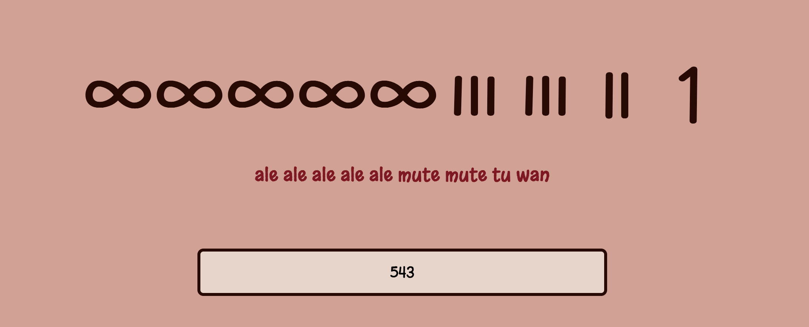
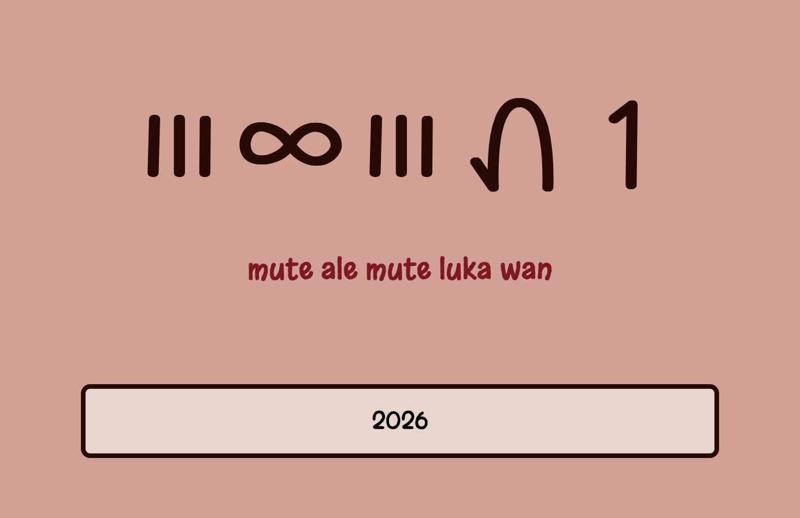
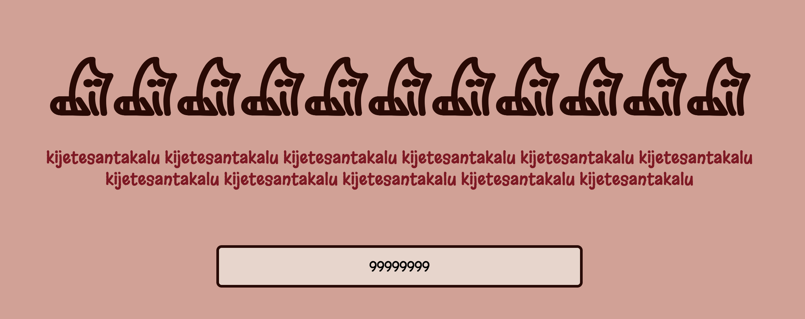

# o-nanpa-pona
> To use the site, go to https://nixii.dev/o-nanpa-pona. 
> Please report any bugs to GitHub issues.

## What is o nanpa pona?
### Overview
o nanpa pona is a tool that lets you convert any digits into toki pona words,
using any of its number systems, including nasin nanpa pona, nasin nanpa pu, and
nasin nanpa kijetesantakalu (kijetesantakalu!).

Additionally, this tool teaches you the basics of actually using these number
systems for yourself, which is great for anyone who wants to learn to speak toki
pona.

### What is toki pona?
toki pona is a minimal constructed language, having less than two hundred words.
Its philosophy is about breaking things down into what they truly are to share
them with people, rather than using abstract concepts that people barely
understand.

If you think it sounds cool, google it!

## Usage
To use this tool, first go to its web page: https://nixii.dev/o-nanpa-pona.

Simply put the number you want to translate into the input box and see it
translated live! If you click on any of the other number systems, you can change
the display to use that system, and change the documentation page to show that system.

## Credit
The sitelen pona (logographs) font was created by lipamanka and is release under the OTF license.

View their site here! https://lipamanka.gay/

## Screenshots
| *Showing the simplest system.* | *Showing the current year.* | *kijetesantakalu o!* |
| ---- | ---- | ---- |
|  |  |  |